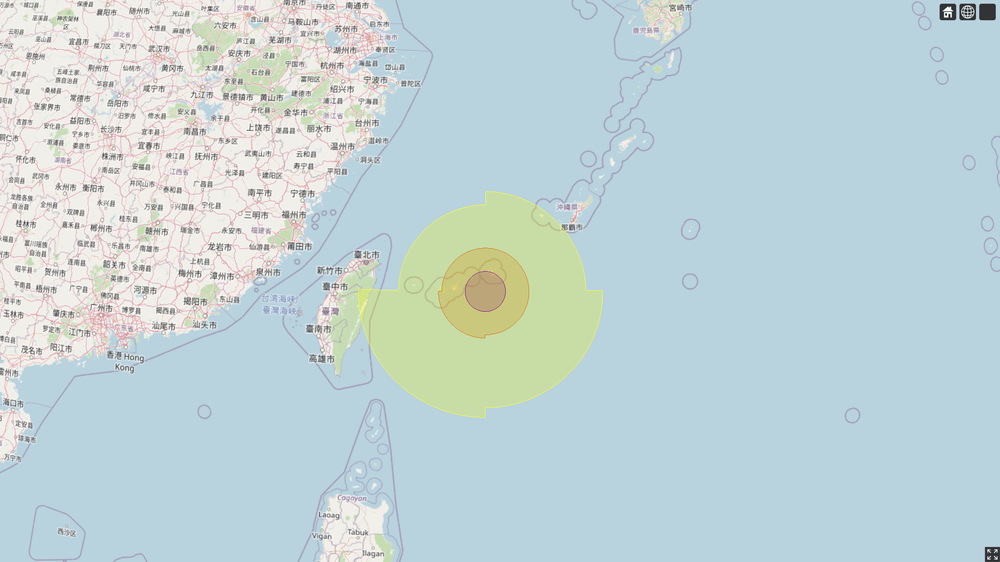

# cesium-typhoon-circle 🌀





### 📑关于

Cesium 下绘制台风风圈，通过计算 90° 的扇形即四分之一圆，获取四个象限的 90° 风圈多边形的经纬度点集，最后使用 polygon 绘制风圈。

### 💻如何运行

```
git clone https://github.com/vensing/cesium-typhoon-circle.git
```

使用 vscode 打开本项目，安装 `Live Server` 插件，选中 index.html 右键 Open with live server，即自动跳转到默认浏览器加载。

或者也可以放到 web 服务器中，作为静态页面加载。
